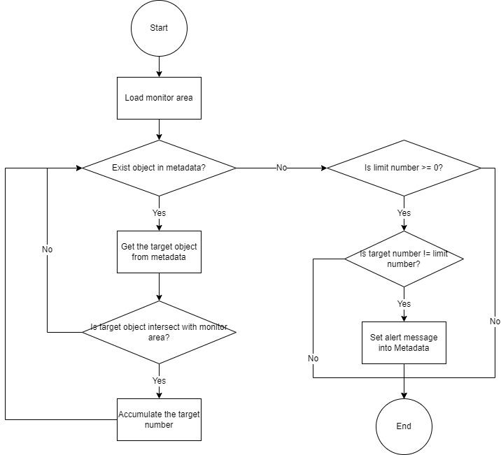

# Chemical Tank Car

Security check is one of the most concerned issue in manufacture, especially for the area checking. For instance, most of the area expressly stipulated the standard protection guardrail. This kind of the protection must placed before operating. Checking irregular placement can remind the operator amend the status.

## Clone the repository

Follow the command below to clone the repository:

```
$ git clone http://GitLab.Adlinktech.com/paul.lin/ai-quick-start-suite.git
```

This might required you to input your adlink account and password. If you do not have the permission, please contact to paul.lin@adlinktech.com.

## Algorithm Description

In this element, the algorithm is designed for monitoring the object that can not appear in the pre-defined area. Illustration below is the main logic implemented:

[You can follow the code line indicate through this link](https://viewer.diagrams.net/?tags={}&highlight=0000ff&edit=_blank&layers=1&nav=1#R7VnbctowEP0aHmGMDDY8tiTQtLSlw2TSPApb2Aqy5chyMPn6SrYcXyG04TrTmUyQVitL2j1Hu2u39JEXTxgM3O%2FURqQFNDtu6TctALo9AFryT7M3qcQ0zVTgMGwrpVwwx69ICTUljbCNwpIip5RwHJSFFvV9ZPGSDDJG12W1JSXlVQPoqBW1XDC3IEE1tQdsczeVDoCZy78g7LjZyl1jmI54MFNWDw5daNN1QaTftvQRo5SnLS8eISKNl9klnTfeMvq2MYZ8vs%2BEje4B8nS%2FBA9G%2B5dBnr%2Fem3HbUHvjm%2BzAyBbnV13KuEsd6kNym0s%2FMxr5NpJP1UQv15lSGghhVwifEOcb5UwYcSpELveIGkUx5r%2Fl9E5f9R4LIzexenLS2WQdn7NNYZLsPhbH8mlJL5tXt5IyXEgjZqkz32nOAvRfvRWYvVrBN2TTaN7O0AaZg%2FgOEyo9abfCAsoHE0Q9JPYjFBgikOOXMq6ggqfzppd7UDSUE5sdumvXL5BEaqW5OAGvu5kQQSHpzrWLOZoHMDHGWrC47CwYBimvljiWTt9u0RfEOIp32iAbNRQn1KUATNVfFyimRG6BXZns8Farm%2B1R3Dr%2FubEF84N9uaEdmhxq6oxisec3QAGtDCijV0FKeiI1q3hJVh6k6%2BUHmVrlQemRaw9KUPd2ng8AUa8B8VpQ%2BO9oylBShFOzdcB54GT294PTwVDQr6HgBz0HDj4QPcG%2BPu2dK35OpgN%2FiF1umxNrdHM3no1my4b4ee5AUCBgTsf3AkEpDORR4fBJ0nEY%2BYkxuCkoBJJp4XbCVvKJQTUV3q3eG2oV3KTrN0%2Fu9ppnnyxEgBpEb2Mcyh36KJY%2FSwY9MTKuwZa51FtE4ftJ3xFyPHNw7hyvV7ebb9epfUmJ8VA7ndEaQ7N5LdnH6XPgfetD%2FVzxbdeuS%2FmlQbjEs8QUQ8tEajxH8r2E8AoXPvsk1wRjB3MCFx1oE%2ByvOLLcjkU9IQ9gRDpCJpoQt58jbK3aoaw622EkKCTEC0IXcrsw5IiJRsgs8d9ykYctSNoc%2Bqu2BeWIOKgQW6tOIM6qT7u6nm9GtBz5O6XQlm9YqI85ZcmLHgSzY8hNZIo18J7g2qtEB72htO2CBgobx6LwsMHjF5pJ7uLPuzwbXBTPmuq4C%2BZZsr0KzX4uOJSLadxFuQOARhdPMvBdJt96xrn51pCfnad4y8Jo1v6rCqJ7hApi31dJJ6o0PuTlwZXx26jz%2By5sYrUmyhbEwrS9xoJDtUgrK4s9yH%2FKamNYvgX6%2FfotAJpugWrtdrhbQLsugHQHwzpC5gkyIEHyA4LmoTCUX8sSiNBEwKENuUQA9KRP%2FUUYpNMvMTQYw%2BOFBtHNv%2BSllX7%2BPVS%2F%2FQM%3D)



## Compilation

This scenario required to install EVASDK in the device. After installing the EVASDK, follow the next steps to compile this plugin and install into your device:

1. Path to the folder of this scenario. Assume that you clone this source code in Home folder.

   ```
   $ cd ~/ai-quick-start-suite/src/chemical-tank-car
   ```

   If you clone in another path, please path to folder "chemical-tank-car".

2. Make the build script executable if needed.

   ```
   $ sudo chmod +x tankcar-build.sh
   ```

   This step is just make sure you have the execute permission for this script.

3. Run the build script and then install to your device.

   ```
   $ ./tankcar-build.sh
   ```

   After run this build script, the plugin will be copied to EVASDK relative folder then clean the GStreamer cache as well.

4. Test the plugin's information.

   for plugin metadata:

   ```
   $ gst-inspect-1.0 python
   ```

   for element metadata:

   ```
   $ gst-inspect-1.0 geocheck
   ```

This plugin, geocheck, contains one feature called geocheck. you can use the command to see the detail in terminal after built.

## Run the plugin

There exists one test optimized models for JNX(NVIDIA NX) in /ai-quick-start-suite/src/chemical-tank-car/NX:

1. yolov4-tiny-608.engine for pose detection

   (if you are using other architecture, you can optimize it through EVASDK user manual by using /ai-quick-start-suite/src/chemical-tank-car/misc/yolov4-tiny-608.onnx)


and other required materials needed in /ai-quick-start-suite/src/chemical-tank-car/NX:

1. area.txt 

   this file could be generated through widget. This widget located in [area-generator.py](../../widgets/area-generator.py). Follow the [instructions here](../../widgets/readme.md) to generate your own area.txt.

2. labels.txt

   lable file used by yolov4-tiny-608.engine.

Test videos are located in [Data](/Data) folder. The videos are used for testing this plugin.

For running this plugin, run the command below for testing:

```
$ gst-launch-1.0 filesrc location=Data/4-4.MP4 ! decodebin ! nvvideoconvert ! videoconvert ! adrt model=NX/yolov4-tiny-608.engine scale=0.004 mean="0 0 0" rgbconv=true ! adtrans_yolo label=NX/label.txt input-width=608 input-height=608 blob-size="19,38" mask="(3,4,5),(1,2,3)" anchor="(10,14),(23,27),(37,58),(81,82),(135,169),(344,319)" class-num=8 use-sigmoid=True ! geocheck alert-area-def=NX/area.txt object-name=traffic-cones-irregular ! videoconvert ! ximagesink sync=false
```

You will see the following result displayed:


Illustrated red area denotes the pre-defied ara provide by user. The object "traffic-cones-irregular" is the target that can not occur in the area. This object name can be set int the property, object-name, of the plugin. This scenario can widly extended to any situation that illegal object is trained in the model and check whether it is appear in the area or not.

