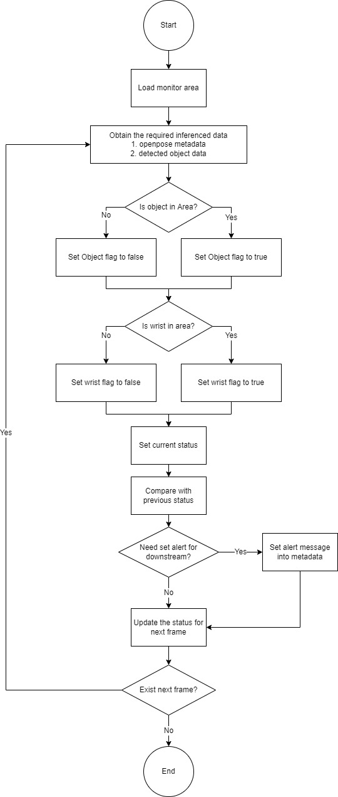
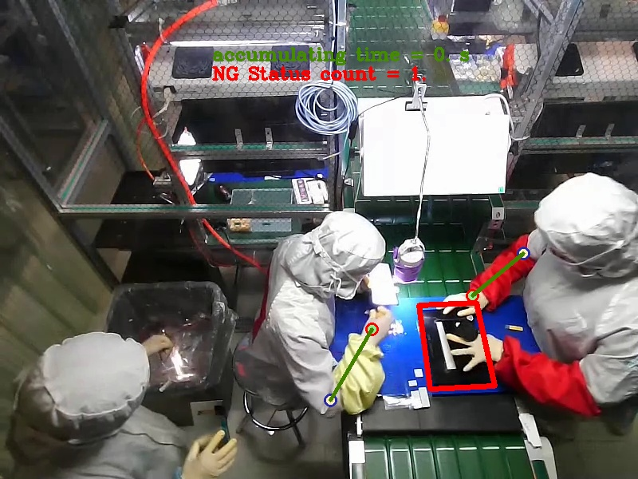

# Operation Idle Monitoring (OIM)

Operation idle monitor, OIM, is a quite useful weapon in measuring the production capacity.

## Clone the repository

Follow the command below to clone the repository:

```
$ git clone http://GitLab.Adlinktech.com/paul.lin/ai-quick-start-suite.git
```

This might required you to input your adlink account and password. If you do not have the permission, please contact to paul.lin@adlinktech.com.

## Algorithm Description

In this element, the algorithm is designed for monitoring the idle status and accumulating. Illustration below is the main logic implemented:

[You can follow the code line indicate through this link](https://viewer.diagrams.net/?tags={}&highlight=0000ff&edit=_blank&layers=1&nav=1&title=OIM#R5VxRc6M2EP41frQHhI3tx5zj3GUmvXSaae%2FSlxsZZEMCiBMitvvrK2FhA5KJL3GM1M5kErRISNrdb7W7ktJzZvHmM4Fp8Bv2UdQDlr%2FpOdc9AOwJAD3%2BY%2FlbQbHH4x1lRUJf0A6Eh%2FAfJIiWoOahj7JaRYpxRMO0TvRwkiCP1miQELyuV1viqN5rCleiR%2BtAePBghKRq30KfBjvqBIwP9C8oXAVlz7Y73b2JYVlZfDgLoI%2FXFZIz7zkzgjHdPcWbGYo490q%2B7NrdHHm7HxhBCT2lwezHbfpXPE7x33f9LfyWzNIfs37J5hcY5WLGYrR0W7IA%2BYwjoogJDfAKJzCaH6ifCM4TH%2FF%2BLFY61LnDOGVEmxGfEKVbIV6YU8xIAY0j8Vaei5hehnPiobYJCJ2AZIVoSz0hFT6XSgeCU58RjhElW1aBoAjS8KUufSiUaLWvd%2BAzexCs%2FhW2S1x%2FYDOgMuujiCk6Z%2FE6CCl6SGHBjDUDW52BMEt32r8MN1wQxzn6gghFm1YelG9LzRXY7ZfldQUIghRUMFDSzs81x3BlHZ6orDbQSluHEtvvFxSGCZ9KgIph%2FMxDwnjKPpQsEWOMVxR8SGEPuBGb66cFYU8r%2FmQPelyTdmTIlYegZfFd92fOrSFjNmWiuOKjBjerkEZwMYB%2BFCbPFHnBwMMxo6cwjwYRH8UNDPtsAN5zP%2BMo6mc5wwojLyK8YH989MJ%2BZ8Rjv3GKCOMYTvqhH6F%2BjJOQYhImK95RRnHqBch7pmGMBl6a9oBz50yHh4GVU2CfSVKc8bkzFsPqPPlwymry3IFRcx8CV567j9hAaCFfvHjiVqcu6DoDGvB8xYydwWo5o5rRsiey0QIjhdVyP8xqycbeLKs1PdFqDbUyWlMF1w2BXeFDNmF3hyGHnGheeLdIF8zZVt1TmMqY2zsTl8HcSJL%2BV9wF6tAmpN9Fc%2F78yJ8HI1G63lReXW9F4R3OMDjVwTgVq0LA1sByXRHynAxf8bXfcZjQShW8XGaISiLed%2FoOqY8lqT%2By2LFDsduaid39VbHbY3ekvdjBUVOfpTBpOmPam%2F%2Fh2JbN%2F21W9bcK3%2FuKLwDOTZvjyUdRY0EDCiTA8SLPXo8vz7BITOtrBBgrFonhJcPJPb66WRH25uCx8kZtGhjTybbSiBcfq%2B8OzYrSGUzKyaGqZokVOVY1CPdjGfcP3GZa9yXwlxFccbFg%2FgwjHoFq4QH2G7kix1Wg272kCwiMz2y6hkLQ%2Ff9AkJJcFwTuEx36IFBWBIPc8Q7W3FMTLWCkFeCBHHaZE2zrLGa9Emq2wRm14cQ5ElKtSZjtIyrYFlHpEzoNVab9oqGTY0n80DR0ejtOwakhEJhohVNgcgg0GR3zv0qgmhIBjbr3v1QG26QIqPRzjEOgvPvwX0WgxgHQRQEIyJen2%2FTRvcnv0Xr%2Bx6dgbEV9VV7aKPxNZPwpJ2rrBb%2BJwfCbgmPw83JSiJDrD6TM89QEdo29X1cFu4%2Fa%2FFVqoyr%2FpCns2tD0Kuo6ywK0jdpE0I34Kdgm6GY45sIrFJnpMRMlQS8h5rjTG4DjYdcAVG7ImoRA59R1r7OFr23YRkJwqFj3%2Fkx9yLsQp0xL1FnL4vxTgjaFN0pgrI0L2jwHNeoairqkZt%2BORUUM2Kb8mkBRDr072vr4eMZ3Fnu3jdpIG2hPZBv4FRUnrYujUxaMEKF7A%2BjjdZJRgmCsY866EY1PFJdHlNH4OXLW6sXamJz1fk%2FKru1IHTao3rMn1YZhw4yswXH%2BCCiOeD%2FUQB6jLOOXE%2FneVJFra79pcnFnx7EbCHe6dnYUh79M83bsU4N%2FWy8oKg7cd3zW422HAC5lcFVyvsylmqLpFSFwW6mQ8sPaWeXL5entcnOrGdnY1qRx2%2Fi1FuWN7oOW7Qbx1qPgrWytqOF8s9u1qIWL3F%2Fq0jdq3FGzVCkb1SW1j3OO5NzBPPFl%2FOp0H9m2FUfIz3QhmRUPN%2FN32nn4BwfO%2FF8%3D)



## Compilation

This scenario required to install EVASDK in the device. After installing the EVASDK, follow the next steps to compile this plugin and install into your device:

1. Path to the folder of this scenario. Assume that you clone this source code in Home folder.

   ```
   $ ~/ai-quick-start-suite/src/operation-idle-monitoring
   ```

   If you clone in another path, please path to folder "operation-idle-monitoring".

2. Make the build script executable if needed.

   ```
   $ sudo chmod +x opcheck-build.sh 
   ```

   This step is just make sure you have the execute permission for this script.

3. Run the build script and then install to your device.

   ```
   $ ./opcheck-build.sh
   ```

   After run this build script, the plugin will be built and copy to EVASDK relative folder then clean the GStreamer cache as well.

4. Test the plugin's information.

   for plugin metadata:

   ```
   $ gst-inspect-1.0 opcheck
   ```

   for element metadata:

   ```
   $ gst-inspect-1.0 opchecktime
   ```

This plugin, opcheck, contains one feature called opchecktime. you can use the command to see the detail in terminal after compilation.

## Run the plugin

There exists two test optimized models for JNX(NVIDIA NX) in /ai-quick-start-suite/src/operation-idle-monitoring/NX:

1. openpose_JNX.engine for pose detection

2. ssdv2.engine for product object detection 

   (if you are using other architecture, you can optimize it through EVASDK usermanual by using /ai-quick-start-suite/src/operation-idle-monitoring/misc/ssd2017.uff)

and other required materials needed in /ai-quick-start-suite/src/operation-idle-monitoring/NX:

1. area.txt 

   this file could be generated through widget. This widget located in [area-generator.py](../../widgets/area-generator.py). Follow the [instructions here](../../widgets/readme.md) to generate your own area.txt.

2. labels.txt

   lable file used by ssdv2.engine.

Test videos are located in [Data](/Data) folder. The videos are used for testing this plugin.

For running this plugin, run the command below for testing:

```
$ gst-launch-1.0 filesrc location=Data/154839_3min.mp4 ! decodebin ! nvvideoconvert ! videoconvert ! adrt model=NX/openpose_JNX.engine scale=0.0039 rgbconv=true ! adtrans_openpose_py ! adrt model=NX/ssdv2.engine batch=1 device=0 scale=0.0078 mean="0 0 0" norm=false ! adtrans_ssd label=NX/labels.txt threshold=0.6 ! opchecktime area-display=true obj-place-def=NX/area.txt object-display=true status-ok-time=7 ! videoconvert ! ximagesink
```

You will see the following result displayed:



Illustrated "accumulating time" denotes the running time of each current state and "NG Status count" represents the exceeded limitation count. This limitation time can be set through the property, status-ok-time, of element opchecktime.

